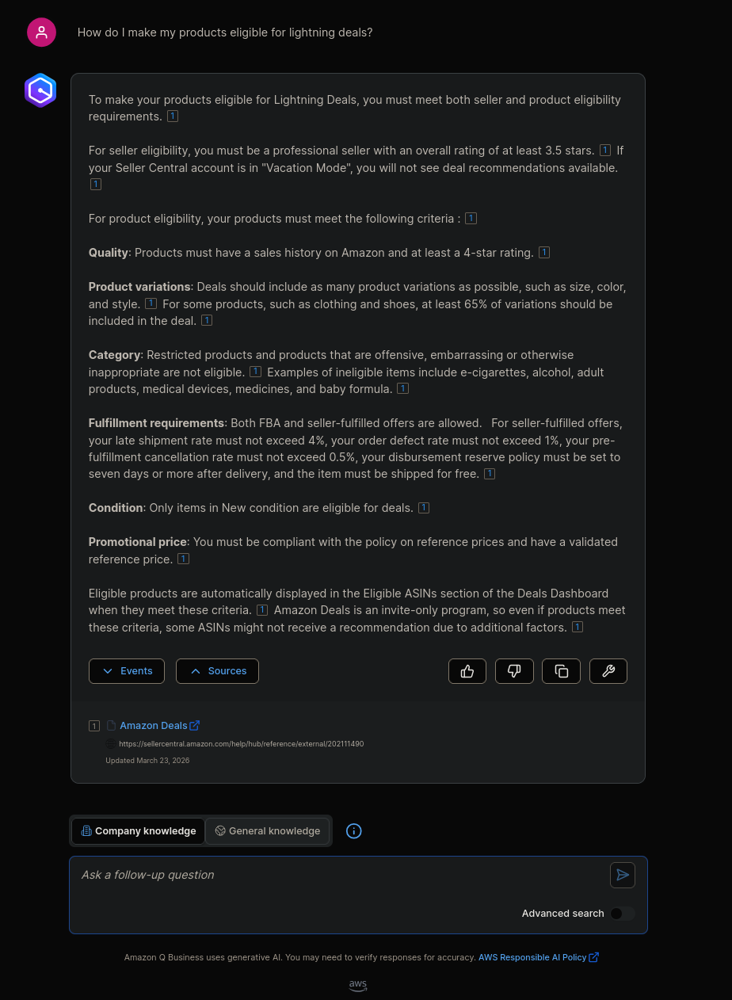
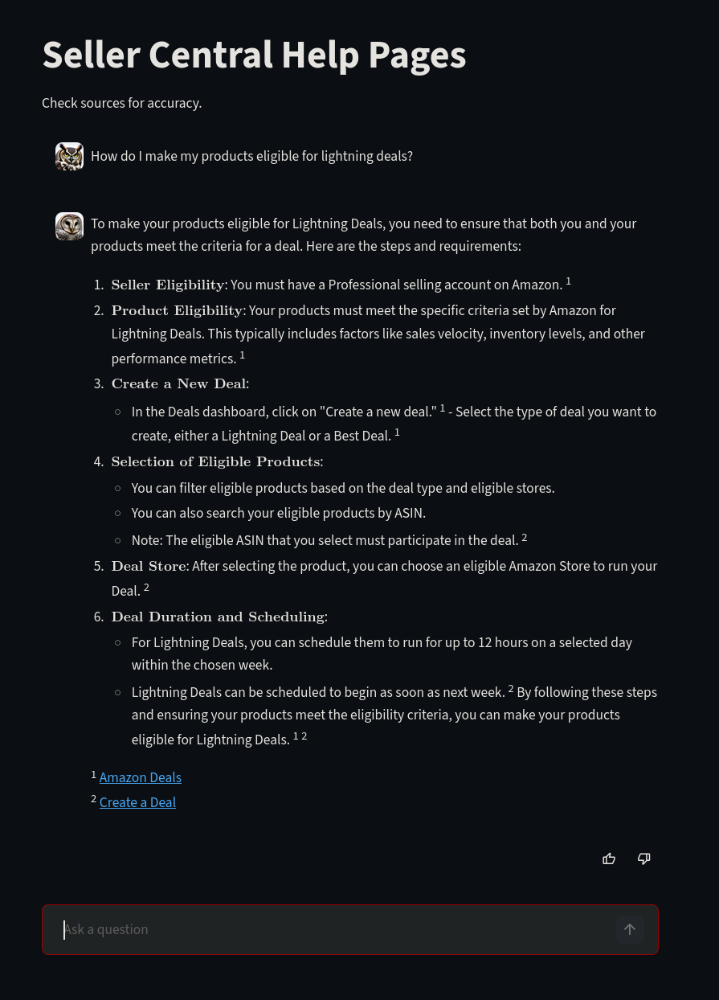
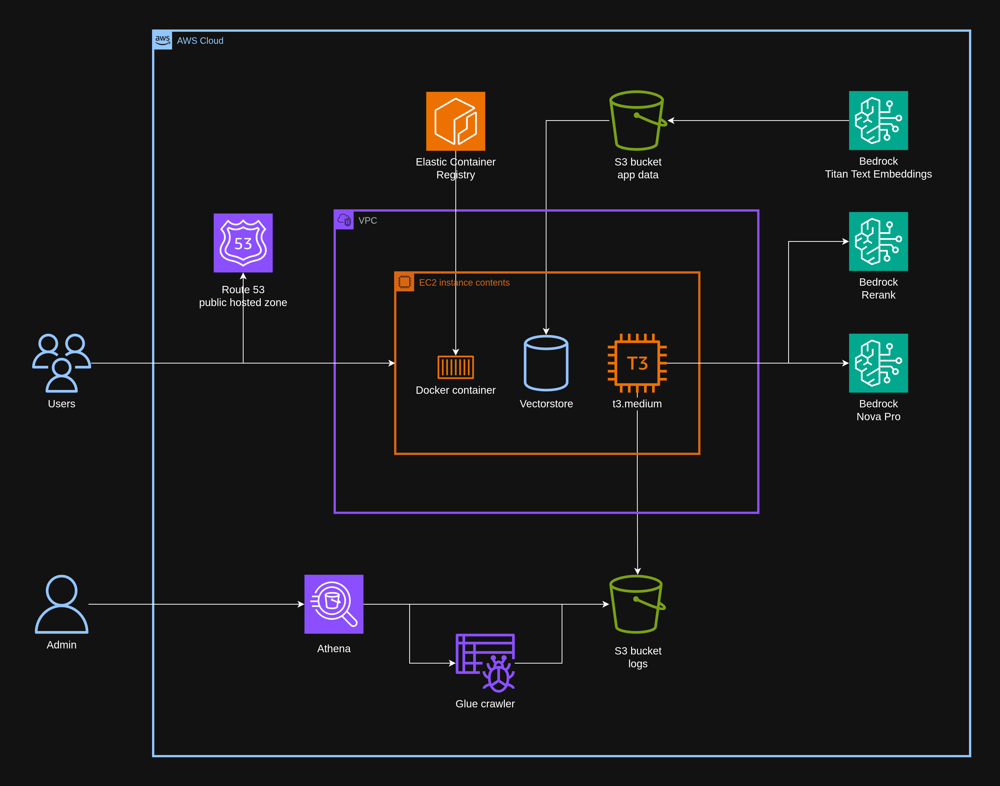

# DIY Q Business Chatbot


**Scenario:**
You want a RAG chatbot to answer questions about a vast trove of company documentation. Q Business offers exactly the user interface you're looking for. You also have the time and expertise to try building and hosting a self-managed application.

**Problem:**
Q Business [pricing](https://aws.amazon.com/q/business/pricing/) is kind of expensive. 
- Q Business Lite is \$3 per user/mo.
- Starter Index is \$0.140 per hour for one unit, or \$102.20 per month.

**Solution:**
Do it yourself!

**Implementation:**
Build an app using Streamlit for the UI, LangChain and FAISS for RAG, Bedrock for the foundation model, and Fargate to host the app.


-----


## Base Case

Build a Q Business chatbot just to get a feel for the experience.

### IAM Identity Center

Create an IAM Identity Center user.

### S3

Pick a webpage with some interesting text and save it as a PDF.
- Example file: [Bitloops.html](data/Bitloops.pdf)

Create a corresponding .metadata.json file with the Title and source URI ([user guide](https://docs.aws.amazon.com/amazonq/latest/qbusiness-ug/s3-metadata.html)).
- Example metadata: [Bitloops.pdf.metadata.json](data/Bitloops.pdf.metadata.json)

Upload the files to an S3 bucket. The path to the the metadata file must match that of the source file but with prefix "metadata/".
- File S3 URI: `s3://symbolfigures/data/Bitloops.pdf`
- Metadata S3 URI: `s3://symbolfigures/metadata/data/Bitloops.pdf.metadata.json`

### Q Business

From the Amazon Q Business dashboard, click Create application. Select:
- User access: Authenticated access
- Access management method: AWS IAM Identity Center

From the application dashboard, click Data sources > Add an index. Select:
- Index provisioning: Starter

From the application dashboard, click Add data source > Amazon S3. Select:
- IAM role: Create a new service role
- Source location: `s3://symbolfigures`
- Metadata location: `s3://symbolfigures/metadata/`
- Filter patterns: Include patterns: Prefix: data/
- Frequency: Run on demand

Sync the data source. Once it's complete, go back to the application dashboard and click the Deployed URL to access the chatbot.

Ask a question pertaining to the document. The answer has footnotes, uses the metadata to link to the source webpage, and has a thumbs up/down for feedback.




-----


## DIY


### 1. Vectorstore

[vectorstore.py](app/vectorstore.py) 

Preparation of the reference material that the chatbot uses to answer questions. 

#### Text extraction

LangChain's PyPDFLoader is used to read the PDF files.

#### Making chunks

A smaller chunk size (256 tokens) is used to balance a relatively high number of chunks that are retrieved during inference, explained later.

An embedding is created for every chunk using Amazon's Titan Text Embedding v2 model. The embeddings and chunks are saved to a FAISS vector store.

For 20,000 PDF files (5 GB) the combined size of the vector stores is 2 GB. This is easily managed by LangChain's InMemoryDocstore on a single EC2 instance.

### 2. Inference

[inference.py](app/inference.py)

Call foundation models for a given query

#### Retrieving chunks

The vector store's built-in similarity_search returns the top K most relevant chunks. The second Bedrock foundation model, Amazon's Rerank 1.0, takes the chunks and returns N of them, sorted by their relevance to the question.

Smaller chunks can lead to more precise answers, but more likely to miss relevant information than large chunks. If a larger number of small chunks are referenced, then the small chunk size is of no disadvantage. Rerank enables the larger number of chunks, because it takes them all and filters some out based on their relevance to the question. That leaves the same small chunk size, and a manageable number of them to send to the final LLM that answers the question.

#### Prompt engineering

The third model, Amazon's Nova Pro, is given this prompt:
```
qa_template = '''You answer questions with reference to provided documents. \
Document exerpts are provided below, ordered by relevance. \
Each exerpt ends with a tag beginning with '#'. \
For any exerpt you reference, include the tag with your answer. \
You can put them between sentences or at the end.

Example 1:
- Question: "What is a bitloop?"
- Answer: "A bitloop as a bit string whose ends are connected to form a loop. #0"

Example 2:
- Question: "What is a type?"
- Answer: "A type is a collection of qualities that characterize a thing. #1"

You may use markdown to format your answer.

Document exerpts:

{context}

Question:

{question}

Answer:'''
```

Nova Pro is informed each chunk ends with a GUID, which is to be included with the answer as a source. It is also asked not to refer the user to the GUID itself. Some examples are given (few shot technique) which it does a decent job of following. It actually does a better job than the examples, dropping them just like footnotes, sometimes mid-answer or multiple times. It has tried making Markdown hyperlinks with them as if they were URLs, so the prompt says it's not a URL.

The context is provided before the question, formatted such that each chunk is a paragraph separated by an empty line.

#### Response formatting

The textual response is returned from the API call. The GUID strings are replaced with footnote markers. Their corresponding document titles and URLs are retrieved from metadata and included at the end of the answer in Markdown.

#### Logging

Each interaction is logged. The log includes the question, answer, and unique ID. If the user provides feedback (thumbs up or down), then the same log is overwritten with the feedback included ([example](example_log.json)).

### 3. User Interface

[gui.py](app/gui.py)

The user interface runs on Streamlit. It's a nice prepackaged chat interface with hardly any configuration needed.

The owl avatars were generated using [FLUX](https://github.com/black-forest-labs/flux).



### 4. Infrastructure

The [app](app) runs in a Docker container on a single EC2 instance.

The instance has a custom [AMI](AMI) configured with a TLS certificate, Nginx web server, robots.txt file, fail2ban, and iptables.

The amazon-cloudwatch-agent sends Nginx access and error logs to a CloudWatch log group.

Interaction logs are sent directly to S3 in a partitioned manner, which can then be crawled by a Glue crawler and queried in Athena.




