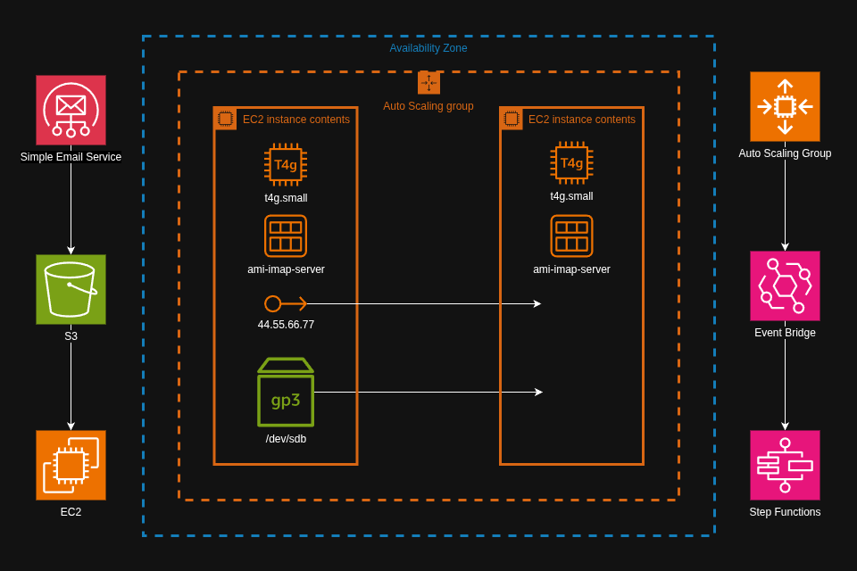

# IMAP Resilience



**Scenario:**
A mail server runs on a single EC2 instance. Clients connect to the server over IMAPS (port 993) to fetch mail. Budget allows for just one instance, and costs need to be kept as low as possible.

**Problem:**
If the instance becomes unhealthy, the admin needs to launch and configure a new instance, during which time clients cannot access their email. The recovery time should not depend on the admin's availability.

**Solution:**
Monitor instance health, so that a failed health check triggers an automatic recovery mechanism. This reduces the recovery time from hours to minutes by not requiring human intervention.

**Implementation:**
Attach an elastic IP to the instance, and mount an EBS volume to the mail directory. An Auto Scaling Group (ASG) replaces the instance when it becomes unhealthy. A lifecycle hook invokes a Step Functions state machine, which attaches the EBS volume and elastic IP to the new instance.

## 1. Given

Here are a few details on how the mail server functions in its current state.

### SES & S3

- Simple Email Service (SES) receives the mail and puts it in an S3 bucket.
- A script on the EC2 instance periodically fetches mail from the bucket and puts it in the mail server's mailbox directory.
- The mail server is only used for receiving mail. Email clients connect directly to SES to send mail.

### EC2

- The instance runs Amazon Linux 2023, configured with Dovecot and SSL certificates.
- The instance is saved as an Amazon Machine Image (AMI).
- The security group allows inbound port 993 from anywhere.
- The EC2 instance profile allows it to read from the S3 bucket.
- An elastic IP is attached.

### Route 53

- A domain is registered in Route 53 with a public hosted zone.
- An A record points to the elastic IP.

### EBS

- An EBS volume is mounted directly to the /var/mail directory, where Dovecot keeps the mailboxes.

## 2. Replace the unhealthy instance

Half of the solution is replacing the instance when it's unhealthy, and this functionality comes out of the box with the ASG.

### ASG

The ASG needs the following:
- A launch template that includes the AMI.
- Minimum and maximum of 1 instance.
- A lifecycle hook.

Creating the launch template using the AWS CLI requires `--launch-template-data`, which can be extracted from an existing template (see [lt-imap-server-data.json](lt-imap-server.json)). Otherwise just create it from the management console.

```
aws ec2 describe-launch-template-versions \
    --launch-template-name "<EXISTING_TEMPLATE>" \
    --query "LaunchTemplateVersions[0].LaunchTemplateData" \
    > lt-imap-server-data.json
```

```
aws ec2 create-launch-template \
    --launch-template-name lt-imap-server \
    --launch-template-data file://lt-imap-server-data.json
```

Specify a subnet when creating the ASG. It needs to be in the same AZ as the EBS volume that stores the mail (see Appendix i).

```
aws autoscaling create-auto-scaling-group \
    --auto-scaling-group-name asg-imap-server \
    --launch-template LaunchTemplateName=lt-imap-server,Version=1 \
    --min-size 1 \
    --max-size 1 \
    --vpc-zone-identifier subnet-xxxxxxxxxxxxxxxxx
```

```
aws autoscaling put-lifecycle-hook \
	--lifecycle-hook-name hook-1 \
	--auto-scaling-group-name asg-imap-server \
	--lifecycle-transition autoscaling:EC2_INSTANCE_LAUNCHING
```

## 3. Attach the EBS volume and elastic IP

An EventBridge rule notices the lifecycle hook and invokes a Step Functions state machine to attach the EBS volume and elastic IP. First create the state machine, and then the EventBridge rule.

### SSM Parameter Store

The state machine needs to know the elastic IP and EBS volume IDs. These can be stored in SSM Parameter Store.

```
aws ssm put-parameter \
    --name /imap-server/eip-id \
    --value eipalloc-xxxxxxxxxxxxxxxxx \
    --type String
```
```
aws ssm put-parameter \
    --name /imap-server/volume-id \
    --value vol-xxxxxxxxxxxxxxxxx \
    --type String
```


### Step Functions

[state-machine.json](state-machine.json) defines the state machine. The steps are summarized as follows:

Part 1: EBS volume
1. Get the EBS volume ID and information about the volume.
2. Check if it's available (not currently attached to an instance).
3. If it is currently attached, then detach it.
4. If it's in another temporary state (e.g. currently being detatched), then wait 10 seconds and check again.
5. Attach the volume to the new EC2 instance. (The instance ID is passed in by the ASG lifecycle hook.)

Part 2: Elastic IP
1. Get the elastic IP ID.
2. Associate it with the new EC2 instance.

Part 3: Stop and start
1. Stop the instance.
2. Wait 10 seconds, make sure it's stopped, and if not then wait 10 seconds.
3. Start the instance.
4. Wait 10 seconds, make sure it's running, and if not then wait 10 seconds.

### EventBridge

[event-pattern.json](event-pattern.json) is the pattern by which the rule notices the lifecycle hook.

```
aws events put-rule \
    --name "imap-server-replace" \
    --event-pattern file://event-pattern.json \
    --state ENABLED
```

The rule needs permission to invoke the Step Function, so create the role ImapServerEventBridge. The role needs the following:
- A [trust policy](EventBridgeTrustPolicy.json) with "events.amazonaws.com" as the Principal.
- A policy [ImapServerEventBridgePolicy](ImapServerEventBridgePolicy.json) that allows action "states:StartExecution" for the specific Step Function.

Add the Step Function as a target.

```
aws events put-targets \
    --rule "imap-server-replace" \
    --targets "Id"="1","Arn"="arn:aws:states:<REGION>:<AWS_ACCOUNT_ID>:stateMachine:imap-server-replace","RoleArn"="arn:aws:iam::<AWS_ACCOUNT_ID>:role/ImapServerEventBridge"
```

## 4. Test

Simply test by terminating the EC2 instance.

# Appendix

## i. Single AZ limitation

This automated solution is limited to a single AZ, because EBS volumes live in a single AZ. A workaround is to take periodic snapshots of the EBS volume and copy them to an alternate AZ. However this comes with the additional cost of storing that copy in the other AZ.

In the event the AZ becomes unavailable for an extended period, the admin can still manually create the instance in a different AZ with a new EBS volume. Then un-delete objects in the S3 bucket to restore the mail. The only drawback is Dovecot will mark all the restored messages as unread.


