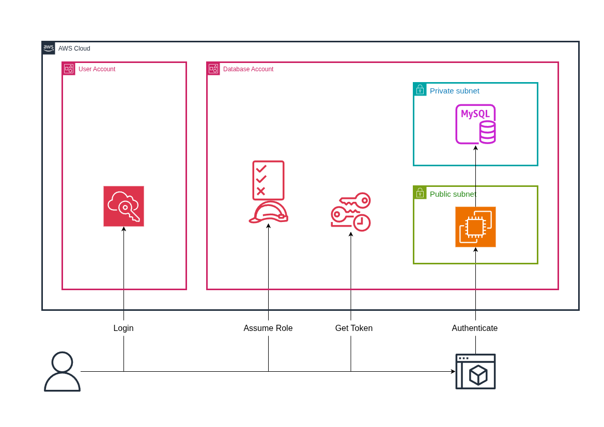
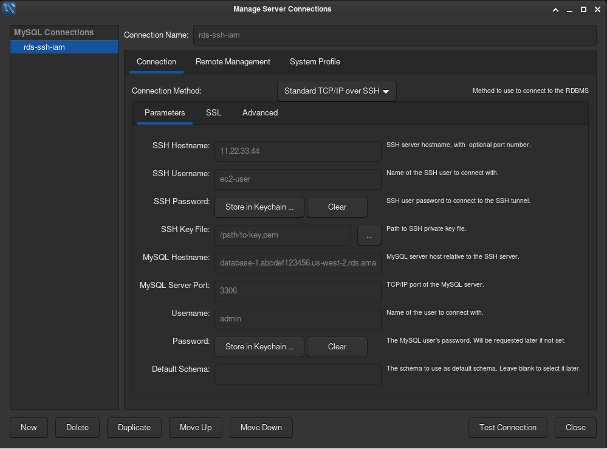

# RDS - Cross-Account IAM Authentication with MySQL Workbench



**Scenario:**
Access to an RDS MySQL database is managed using traditional usernames and passwords. Users run MySQL Workbench from their workstations using connection method TCP/IP over SSH. Each user has their own AWS account.

**Problem:**
The security team wants to stop using password authentication. 

**Solution:**
Switch to IAM authentication.

## 1. Base Case

Connect with a username and password.

### 1.1. Build

Create the RDS database in a private subnet. Set password authentication.

Launch an EC2 instance in a public subnet (the bastion host).

Install MySQL Workbench on your local machine.

### 1.2. Test

SSH into the bastion host, and connect to the RDS database using the DNS name given in the RDS console. Create a database.

```
$ ssh -p 22 -i path/to/key.pem ec2-user@22.33.44.55
$ sudo dnf install mariadb105
$ HOST=database-1.abcdef123456.us-west-2.rds.amazonaws.com
$ mysql -h $HOST -u admin -p
$ > CREATE DATABASE test_db
$ > exit
$ exit
```

### 1.3. Connect

Run MySQL Workbench and create a new connection with method "Standard TCP/IP over SSH".



Error: `Could not store password: The name is not activatable`  
Install a keyring. `$ sudo pacman -S gnome-keyring`

Click on the new connection and enter the password. Show the databases.

```
$ SHOW DATABASES;
```

## 2. IAM Authentication

Connect with IAM credentials.

### 2.1. Configure

RDS dashboard > Modify. Switch from "Password authentication" to "Password and IAM database authentication".

From the EC2 instance, connect to the database and update the plugin from `caching_sha2_password` to `AWSAuthenticationPlugin`.

```
$ SELECT User, Host, plugin FROM mysql.user WHERE User = 'admin';
$ ALTER USER 'admin'@'%' IDENTIFIED WITH AWSAuthenticationPlugin AS 'RDS';
```

### 2.2. Connect

From your local machine, login to the AWS CLI. Make sure a profile is setup for the account that owns the database.

```
$ aws sso login
$ cat ~/.aws/config
```

Generate an RDS token.

```
$ aws rds generate-db-auth-token \
	--hostname database-1.abcdefg123456.us-west-2.rds.amazonaws.com \
	--port 3306 \
	--username admin \
	--region us-west-2 \
	--profile <DB_ACCOUNT>
```

Copy the response and use it as the password in MySQL Workbench.

## 3. Cross-Account

Get an RDS token as a user from another account.

### 3.1. IAM Role - Database Account

Create the role RDSCrossAccountAccessRole.

Set the [Trust Policy](TrustPolicy.json) to allow `"Action": "sts:AssumeRole"` from the other account.

Create the policy [RDSDatabaseConnectPolicy](RDSDatabaseConnectPolicy.json). Allow `"Action": "rds-db:connect"` for the specified database.

### 3.2. IAM Role - User Account

If the IAM user has limited account privileges, it may need the [AssumeCrossAccountRolePolicy](AssumeCrossAccountRolePolicy.json) policy attached to assume the role in the database account.

### 3.3 Assume Role

Assume the role from the user account.

```
$ aws sts assume-role \
	--role-arn arn:aws:iam::<DB_ACCOUNT_ID>:role/RDSCrossAccountAccessRole \
	--role-session-name "WorkbenchSession"
```

Save the response.

```
$ export AWS_ACCESS_KEY_ID="________________"
$ export AWS_SECRET_ACCESS_KEY="________________"
$ export AWS_SESSION_TOKEN="________________"
```

Ensure the database account's account ID is returned by STS.

```
$ aws sts get-caller-identity
```

Get an RDS token via `aws rds generate-db-auth-token` and connect.

