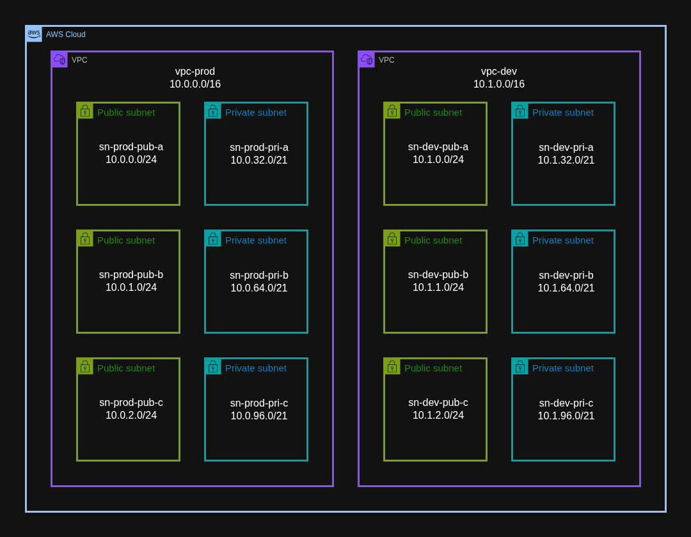

# VPC Planning

Building VPCs and subnets is free and easy, but worth being meticulous about, because they make their appearance every time you build a resource inside of them.

It's worthwhile to be intentional about every detail, including:
- Naming conventions
- CIDR block partitions

Names and CIDR blocks should be scalable, so that more can be added later in an iterative way.

The CloudFormation template [DualVpc.yaml](DualVpc.yaml) demonstrates such a pattern.

## 1. Naming conventions

### 1.1. Service Type Prefix

It's natural to name something after what it's being used for. An account could have one VPC for production and another VPC for development, so the VPCs are named 'prod' and 'dev'. But then the same logic could apply to their respective subnets, route tables, internet gateways, etc. Then 'prod' (or 'dev') is seen in many places, and sometimes it's hard to tell which service type the name refers to.

That's why prefixing a name with the service type can be useful. 'vpc-prod' is distinguished from 'subnet-prod' (or 'sn-prod'), 'ig-prod', etc.

### 1.2. Names as Compact Descriptions

If you only have two subnets and name them 'subnet-1' and subnet-2', you will remember what each one is for. But if you add another 40 subnets and follow the same naming convention, they will be hard to tell apart.

There are other differentiating factors for subnets, like the availability zone, and whether they are public or private. It follows that these qualities, or tokens, should be in the name too. The additional complexity make it one more thing to be abnormally intentional about.

Standardize the use of capitalization, separation of tokens, and order of tokens. Then you can add more later without creating duplicates or breaking from convention.

## 2. CIDR block partitions

### 2.1. Obstacles

CIDR blocks get less attention than names do, but they can't be edited. If you want to recreate a VPC or subnet just to edit the CIDR, first you need to destroy everything inside it. That could involve:
- Interrupting active resources
- Hunting down leftovers from forgotten projects
- Recreating security groups (if deleting a VPC)

CIDRs are also harder to read than names, so the partitioning should be as straightforward as possible.

### 2.2. Private and Public

It's easy to assign a /24 subnet mask to every subnet, allowing 256 IPs (251 resources) per subnet, and likely never run out. But nothing is stopping you from considering the whole space, so you might as well, especially given the difficulty of changing it later.

Private subnets generally have more resources than public subnets. It follows that their respective IP spaces should be in proportion. The right number can also make the IPs more readable. Consider /24 for public and /21 for private.

Given a VPC with CIDR block 10.0.0.0/16:

Look at an IP in a public subnet with /24 subnet mask (e.g. 10.0.5.112). Each of the four octets are nicely aligned with a meaningful purpose:
- The 1st octet just says it's a private IP (RFC 1918).
- The 2nd octet defines the VPC.
- The 3rd octet defines the subnet.
- The 4th octet defines the resource. 

It also means there are 256 potential subnets, and 256 IPs per subnet. For the private subnets, lose some subnets to gain more IPs by using the /21 preifx. Then there are 32 possible subnet CIDRs, and they look like this:
- 10.0.0.0/21
- 10.0.32.0/21
- 10.0.64.0/21
- 10.0.96.0/21
- ...
- 10.0.224.0/21

Reserve 10.0.0.0 - 10.0.31.0 for 32 public subnets, and the rest for 31 private subnets. Then you can tell if an IP belongs to a private or public subnet just by looking at it.
